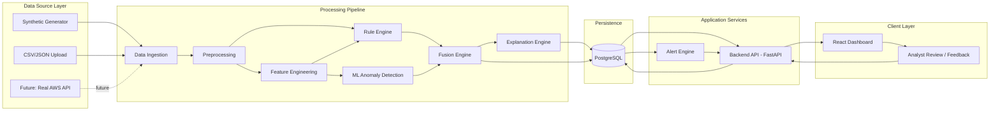
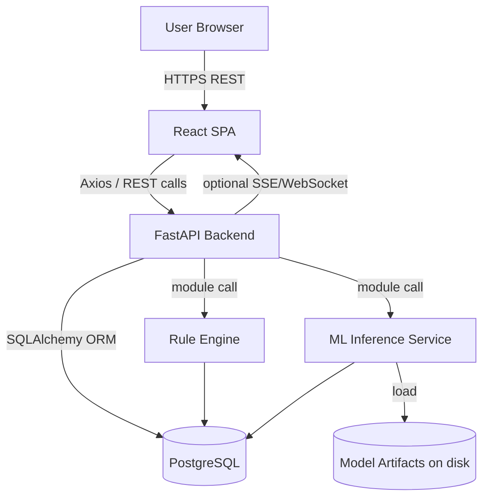

# APP_ARCHITECTURE.md

## Smart Anomaly Detection Platform for Automated Weather Stations (AWS)
### Technical Architecture Document — Smart India Hackathon (SIH)

**Source of truth:** `PROJECT_REQUIREMENTS.md` (product-level requirements). This document translates those requirements into a concrete, buildable technical architecture for a 6-person team.

**Document status:** v1.0 — Second planning artifact. No source code, SQL, or implementation is included here. This is the technical source of truth for subsequent documents: `DATABASE_SCHEMA.md`, `API_SPECIFICATION.md`, `ML_PIPELINE.md`, `UI_UX_SPECIFICATION.md`, `DEPLOYMENT.md`, `TESTING_STRATEGY.md`.

---

## Table of Contents

1. Architecture Overview
2. Architecture Goals
3. Architecture Principles
4. End-to-End Application Flow
5. System Components
6. Architecture Diagram
7. Detailed Data Flow
8. Frontend Architecture
9. Backend Architecture
10. AI/ML Architecture
11. Data Ingestion Architecture
12. Data Storage Architecture
13. Alert Architecture
14. Authentication & Authorization
15. Folder & File Structure
16. Important Project Files
17. Technology Stack
18. Component Communication
19. Configuration Strategy
20. Error Handling
21. Logging & Monitoring
22. Testing Architecture
23. Deployment Architecture
24. Six-Person Team Ownership
25. MVP Architecture
26. Future Scale Architecture
27. Architecture Decision Table
28. Technologies to Avoid in MVP
29. Development Order
30. Final Recommended Architecture Summary

---

## 1. Architecture Overview

The platform is built as a **modular monolith**: a single deployable backend service with clearly separated internal modules (ingestion, rule engine, ML detection, fusion, alerts, analytics, API), paired with a separate frontend single-page application. This avoids the operational overhead of microservices while preserving clean internal boundaries so any module could later be extracted into its own service if scale demands it.

Data flows one direction through a pipeline: a **data source layer** (synthetic generator, CSV/JSON upload, or — in the future — a real AWS feed) feeds a **data ingestion layer**, which hands normalized observations to **preprocessing**, then to a **rule-based validation engine** and a **feature engineering layer** in parallel, both of which feed an **ML anomaly detection layer**. Rule outputs and ML outputs are combined in a **fusion engine** that produces a final score, severity, and explanation. Results are persisted, evaluated against **alert rules**, and exposed through a **REST API** consumed by the **React dashboard**. Analysts close the loop by reviewing and classifying anomalies, and that feedback is stored for future model improvement.

The architecture is explicitly designed so that:
- The data source can be swapped (synthetic → real AWS feed) without touching downstream logic.
- ML models can be swapped or added without touching the API, database schema, or frontend.
- The whole system can run locally via Docker Compose with zero external dependencies, which is critical for reliable SIH judging.

## 2. Architecture Goals

1. **Buildable in a hackathon timeframe** by a 6-person team working largely in parallel.
2. **Modular**, with hard boundaries between ingestion, rules, ML, fusion, alerts, and API — even though they run in one process for the MVP.
3. **Swappable data sources** — synthetic generator today, real AWS API later, via one adapter interface.
4. **Swappable ML models** — a common detector interface so Isolation Forest can be replaced or supplemented without rewriting the pipeline.
5. **Explainable by default** — every anomaly carries a human-readable reason, not just a score.
6. **Demo-reliable** — the entire stack must run offline via Docker Compose in case of unreliable venue internet.
7. **Extensible without redesign** — new stations, parameters, rules, and models must be addable via configuration, not core rewrites.
8. **Avoid overengineering** — no infrastructure (Kafka, Kubernetes, microservices, multiple databases) that the MVP does not actually need.

## 3. Architecture Principles

- **Single source of truth for product scope:** every architectural choice traces back to a requirement in `PROJECT_REQUIREMENTS.md`; nothing is added "because it's interesting."
- **Adapter pattern at every external boundary:** data sources, notification channels, and (to a lesser extent) ML models are accessed through interfaces, not concrete implementations, so they can be replaced.
- **Separation of concerns:** API routes contain no business logic; business logic lives in services; data access lives in repositories; ML lives in its own module called only through a thin service boundary.
- **Configuration over hard-coding:** thresholds, model paths, data source selection, and feature flags live in environment variables / config files, never inline in code.
- **Explainability is architectural, not cosmetic:** the fusion engine's output schema always includes an explanation field — it is not an optional add-on bolted on later.
- **Fail gracefully, per-station:** a failure processing one station's data must never block ingestion or detection for other stations.
- **Boring technology where it doesn't matter:** PostgreSQL instead of a distributed database, REST instead of GraphQL, a modular monolith instead of microservices — reliability and team velocity matter more than novelty for a hackathon MVP.

## 4. End-to-End Application Flow

```
Automated Weather Station / Mock Data Source
   → Data Ingestion
   → Validation
   → Data Cleaning & Preprocessing
   → Feature Engineering
   → Rule-Based Quality Checks
   → AI/ML Anomaly Detection
   → Anomaly Scoring & Classification   (Fusion Engine)
   → Explanation Engine
   → Database / Time-Series Storage
   → Alert Engine
   → Backend API
   → Dashboard
   → Human Review / Feedback
```

**Stage-by-stage explanation:**

1. **Data Source** — Either the synthetic generator (default for MVP/demo), a CSV/JSON historical upload, or (future) a live AWS API/feed. All sources implement the same `DataSourceAdapter` interface.
2. **Data Ingestion** — Receives raw payloads, resolves them to a known station and parameter set, and hands them to validation. Handles both batch (historical upload) and near-real-time (polled/streamed) modes through the same internal pipeline function.
3. **Validation** — Schema-level checks: required fields present, correct types, plausible timestamp format. Malformed records are rejected here before they ever reach business logic.
4. **Data Cleaning & Preprocessing** — Timestamp normalization (UTC), unit normalization, duplicate detection/removal, and time-ordering. Produces a clean, canonical `Observation` record.
5. **Feature Engineering** — Computes rolling statistics, rate-of-change, z-scores, and contextual features (time-of-day, seasonality) needed by both rules and ML models. Runs once, shared by both downstream consumers.
6. **Rule-Based Quality Checks** — Deterministic checks (range, rate-of-change, stuck value, missing data, cross-parameter plausibility) run against the cleaned observation and engineered features.
7. **AI/ML Anomaly Detection** — One or more detectors (Isolation Forest for MVP) score the observation using the engineered features, independent of the rule engine.
8. **Anomaly Scoring & Classification (Fusion Engine)** — Combines rule violations and ML score into one final anomaly score, category, and severity.
9. **Explanation Engine** — Converts the fusion engine's structured output into a human-readable explanation string, using the specific rule(s) violated and/or the magnitude of ML deviation.
10. **Database / Time-Series Storage** — The raw observation, its features (optionally), and any resulting anomaly record are persisted in PostgreSQL.
11. **Alert Engine** — Evaluates the stored anomaly against alert rules (severity thresholds, deduplication) and creates/updates an `Alert` record if warranted.
12. **Backend API** — Exposes all of the above (stations, observations, anomalies, alerts, analytics) via REST endpoints.
13. **Dashboard** — The React frontend polls/queries the API and renders station health, anomaly feeds, and time-series charts with anomaly markers.
14. **Human Review / Feedback** — An analyst opens an anomaly, reviews the explanation and context, and marks it as confirmed or false-positive; this updates the anomaly's status and is stored as feedback for future model tuning.

## 5. System Components

| # | Component | Responsibility |
|---|---|---|
| 1 | Data Source Layer | Abstracts where observations come from (synthetic, file, future real API) behind one interface |
| 2 | Data Ingestion Layer | Accepts, identifies, and routes incoming observations (batch + near-real-time) |
| 3 | Data Preprocessing Layer | Cleans, normalizes, deduplicates, and windows data for downstream use |
| 4 | Rule-Based Validation Engine | Deterministic, configurable quality checks |
| 5 | Feature Engineering Layer | Shared, reusable time-series feature computation |
| 6 | ML Anomaly Detection Layer | Pluggable statistical/ML detectors behind a common interface |
| 7 | Anomaly Fusion Engine | Combines rule + ML output into one scored, classified anomaly |
| 8 | Explainability Layer | Converts fusion output into human-readable explanations |
| 9 | Data Storage Layer | PostgreSQL persistence for all entities |
| 10 | Backend API Layer | REST API exposing all functionality to the frontend |
| 11 | Frontend / Dashboard Layer | React SPA consumed by all user roles |
| 12 | Alert Engine | Evaluates anomalies against alert rules, manages alert lifecycle |
| 13 | Human Feedback Loop | Captures analyst classification of anomalies for future model use |

### 5.1 Data Source Layer

Implements a `DataSourceAdapter` interface with concrete implementations:
- `SyntheticDataSource` — generates plausible multi-station, multi-parameter time-series with injectable anomalies (default for MVP/demo).
- `FileDataSource` — parses uploaded CSV/JSON historical datasets into the same internal record shape.
- `LiveAWSDataSource` (future/stub only) — placeholder implementing the same interface for a real government AWS feed, not implemented in MVP per Requirements Quality Rule #1.

Downstream code (ingestion onward) depends only on the interface, never on a concrete source, so the active source is a configuration choice (Section 19).

### 5.2 Data Ingestion Layer

- **Batch ingestion:** processes uploaded files or bulk synthetic backfills in a loop, reusing the same per-observation pipeline function used for real-time data.
- **Near-real-time ingestion:** polls or receives pushed observations from the active data source at a configurable interval and processes them as they arrive.
- **Station identification:** resolves an incoming record's station identifier against the registered `Station` table; unknown stations are rejected with a clear error (do not silently create stations from untrusted input in MVP).
- **Sensor/parameter mapping:** maps incoming parameter names/units to the platform's canonical parameter list (Section 9.2 of `PROJECT_REQUIREMENTS.md`).
- **Duplicate detection:** rejects/flags records with an existing (station, parameter, timestamp) combination.
- **Error handling:** malformed or unresolvable records are logged and reported via an ingestion error count, without halting processing of subsequent records or other stations.

### 5.3 Data Preprocessing Layer

Responsibilities, clearly separated from anomaly detection itself:
- Missing-value representation (explicit gap marking, not silent dropping).
- Invalid-value rejection (fails schema/type checks).
- Type conversion and unit normalization to canonical units (e.g., always Celsius, always hPa).
- Timestamp sorting per station/parameter stream.
- Duplicate removal (post-ingestion safety net).
- Basic noise handling (e.g., rounding-precision normalization).
- Construction of rolling time windows per station/parameter, which both the rule engine and the feature engineering layer consume.

**Boundary rule:** preprocessing never makes an anomaly judgment — it only produces clean, well-formed data. Anomaly judgments belong exclusively to the rule engine and ML layer downstream.

### 5.4 Rule-Based Validation Engine

A configurable, modular set of checks, each implemented as an independent, testable function/class rather than inline logic in API controllers:

- Valid physical range per parameter (config-driven, per-parameter bounds).
- Rate-of-change threshold per parameter.
- Frozen/stuck-sensor detection (identical value for N consecutive readings, N configurable).
- Missing-data detection (gap vs. expected sampling interval).
- Repeated-value / duplicate-record detection.
- Impossible-value combinations (e.g., humidity > 100%).
- Cross-parameter relationship checks (e.g., solar radiation vs. expected daylight window) — MVP implements 1–2 illustrative checks, full set is future scope per `PROJECT_REQUIREMENTS.md` Section 12.
- Sensor-specific rule overrides (per station/sensor configuration).

Rules are registered in a rule registry and executed as a pipeline; each rule returns a structured violation object (rule name, severity contribution, message) rather than a raw boolean, so the fusion engine has enough detail to build an explanation.

### 5.5 Feature Engineering Layer

A single, reusable feature pipeline shared by rules and ML (not duplicated per detector):

- Rolling mean, rolling standard deviation, rolling min/max (configurable window sizes).
- Difference from previous reading; percentage change.
- Z-score relative to rolling baseline.
- Time-of-day and day-of-year/seasonality indicators.
- Lag features (previous N readings).
- Moving variance and simple trend/slope features.
- Sensor correlation features (e.g., temperature-humidity relationship) for the multi-parameter checks.
- Station-specific baselines (a station's own historical norms, not a global norm).

Features are computed once per incoming observation and cached/attached to the record passed to both the rule engine and the ML detector, avoiding duplicate computation.

### 5.6 ML Anomaly Detection Layer

A common detector interface, implemented by any concrete model:

```
BaseDetector
├── train(training_data)
├── predict(observation_features)
├── score_anomaly(observation_features) -> float
├── save_model(path)
└── load_model(path)
```

**MVP recommendation:** a single **Isolation Forest** detector trained per parameter (or per station-parameter pair, resourcing permitting), operating on the engineered features from Section 5.5. Isolation Forest is recommended because it:
- Requires no labeled anomaly data (fits the unsupervised constraint in `PROJECT_REQUIREMENTS.md` Section 8.1).
- Trains and infers quickly on tabular feature data — practical within hackathon time and compute constraints.
- Is simple to explain (anomaly score + relative feature deviation), supporting the explainability requirement.
- Is well-supported in scikit-learn with no additional infrastructure.

A lightweight **statistical detector** (e.g., z-score/rolling-window threshold) is recommended as a second, simple detector to demonstrate the "pluggable model" architecture and to provide a fallback when insufficient history exists to trust Isolation Forest (e.g., a newly onboarded station). Autoencoders and other deep-learning approaches are explicitly deferred (Section 26) — they add training/infrastructure complexity disproportionate to MVP needs.

### 5.7 Anomaly Fusion Engine

Combines, per observation:
- Rule engine violations (list of triggered rules with severity weights).
- ML anomaly score(s) (from one or more detectors).
- Temporal context (e.g., is this part of an ongoing anomaly episode, or an isolated point).
- Multi-parameter context (are other parameters at this station also flagged concurrently).

**Output schema:**
- `final_score` (normalized 0–1 or similar)
- `category` (e.g., spike, stuck, missing, drift, cross-parameter, station-level)
- `severity` (Informational/Low/Medium/High/Critical)
- `confidence`
- `detection_source` (rule / ml / both, and which specific rule(s)/model(s))
- `explanation` (from Section 5.8)

Fusing rule and ML signals reduces reliance on a single detection method: a rule violation without ML confirmation can still be surfaced at lower severity, an ML flag without a rule violation is treated cautiously (informational/low) unless corroborated, and agreement between both raises confidence and severity. This directly implements `PROJECT_REQUIREMENTS.md` Section 7.C's requirement that rules complement rather than replace ML.

### 5.8 Explainability Layer

Builds a human-readable explanation string from the fusion engine's structured output. Inputs available to the explanation builder:
- Observed value and expected range/predicted value
- Previous value(s) for trend context
- Which rule(s), if any, were violated
- ML anomaly score and deviation magnitude
- Related parameter behavior (for cross-parameter anomalies)

Example output:
> "Temperature increased from 29.1°C to 47.8°C within 10 minutes. This exceeds the configured rate-of-change threshold and received an ML anomaly score of 0.91."

Explanation generation is template-based for MVP (structured strings filled from the fusion output), not a separate generative-AI call — this keeps it fast, deterministic, and dependency-free, which matters for demo reliability. A future enhancement could layer natural-language generation on top (Section 26).

### 5.9 Data Storage Layer

A **single PostgreSQL database is sufficient for the MVP.** Logical entities (conceptual, not a schema — see `DATABASE_SCHEMA.md` for the actual design):
- Users, Stations, Sensors, Observations, Anomalies, Alerts, Anomaly Feedback, Model Metadata, System/Audit Logs.

Reasoning: observation volume for a hackathon demo (a handful of simulated stations, moderate sampling frequency) is well within standard PostgreSQL's comfortable operating range; introducing a distributed or specialized time-series database adds operational complexity with no MVP-stage benefit. If future scale requires it, the **TimescaleDB extension** for PostgreSQL is the recommended upgrade path (Section 26) — it preserves the same SQL interface and ORM compatibility while adding hypertable-based time-series performance, so it can be adopted without a data-layer rewrite.

### 5.10 Backend API Layer

REST API (see Section 9 for full backend architecture) organized by resource:
- Authentication, Stations, Observations, Anomalies, Alerts, Analytics, Dashboard (aggregate endpoints), Model/ML status, Feedback/Review.

WebSockets/SSE are an **optional** MVP addition, useful specifically for pushing live alert notifications to the dashboard without polling; the architecture must not depend on them (Section 18).

### 5.11 Frontend / Dashboard Layer

React SPA covering the pages listed in `PROJECT_REQUIREMENTS.md` Section 7.H–I (Section 8 below has full detail).

### 5.12 Alert Engine

- **Creation:** triggered when a fused anomaly's severity crosses a configurable threshold.
- **Severity filtering:** only High/Critical trigger alerts by default (configurable).
- **Duplicate prevention:** an ongoing anomaly episode updates its existing alert rather than creating a new one each observation.
- **Acknowledgement/Resolution:** status transitions (New → Acknowledged → Resolved/Dismissed), performed via the API by authorized roles.
- **Notification channel abstraction:** in-app is the only implemented channel for MVP; email/SMS/push are defined as an interface with no concrete implementation required (`PROJECT_REQUIREMENTS.md` Section 7.J marks these P2).

### 5.13 Human Feedback Loop

Analysts classify anomalies as Confirmed / False Positive / Under Review / Resolved via the API. Feedback is stored alongside the anomaly record (see Section 9's data storage layer) so it can later feed model retraining. **No automatic retraining occurs in the MVP** — feedback is captured and stored, but retraining is a manual, future-scope process (`PROJECT_REQUIREMENTS.md` Section 12), since automatic retraining introduces validation/rollback complexity not justified for a hackathon timeline.

## 6. Architecture Diagram



**Second diagram — Frontend/Backend/Data interaction:**



## 7. Detailed Data Flow

### Flow 1 — Incoming Weather Observation

1. AWS (or synthetic source) sends an observation.
2. Ingestion service receives the payload.
3. Schema validation occurs (required fields, types, timestamp format).
4. Observation is normalized (units, UTC timestamp, canonical parameter name).
5. Raw observation is stored in the `Observation` table.
6. Preprocessing constructs the relevant rolling window for that station/parameter.
7. Rule checks execute against the observation and window.
8. Feature engineering computes derived features for the same window.
9. ML model performs inference using the engineered features.
10. Rule and ML outputs are combined by the fusion engine into a final score/category/severity.
11. The explanation engine generates a human-readable reason.
12. An `Anomaly` record is stored if the fused result crosses the "flaggable" threshold.
13. The alert engine evaluates the anomaly and creates/updates an `Alert` if severity warrants it.
14. The dashboard reflects updated state on next fetch (or push, if SSE/WebSocket is enabled).
15. An analyst can open the anomaly and review it.

### Flow 2 — Historical Dataset Upload

A CSV/JSON file is parsed by the `FileDataSource` adapter into the same internal observation record shape used by real-time ingestion, then pushed through the **identical pipeline function** used in Flow 1 (steps 2–13), processed as a batch loop rather than one-at-a-time streaming. This reuse is deliberate: it guarantees that historical backfills are validated and scored with exactly the same logic as live data, with no parallel code path to maintain or drift out of sync.

### Flow 3 — User Opens Dashboard

```
Frontend (React) → Backend API (FastAPI) → Database / Analytics queries (PostgreSQL) → Aggregated JSON response → Dashboard widgets render
```

The dashboard's summary widgets (station counts, active anomalies, critical alerts) are served by dedicated **aggregate API endpoints** rather than requiring the frontend to fetch and reduce raw data client-side, keeping the frontend simple and the heavy lifting in the backend/database.

### Flow 4 — Analyst Reviews Anomaly

```
Anomaly detail (frontend fetch) → analyst decision (Confirm / False Positive / Under Review) →
API call to feedback endpoint → feedback stored in Anomaly Feedback table →
Anomaly.status updated → Audit log entry created → Dashboard reflects new status
```

### Flow 5 — Model Training

```
Historical data (from Observation table or bulk export) → preprocessing → feature engineering →
training script (offline, run manually or via scheduled job) → evaluation against held-out data →
model artifact saved to disk (versioned filename) → model registry/config updated to point at new artifact →
inference service loads the new artifact on next restart / reload
```

Training is an **offline, manual/scripted process** for the MVP — not triggered automatically from the API — to keep the live system simple and avoid unbounded training jobs interfering with demo reliability.

## 8. Frontend Architecture

**Stack:** React + Vite + TypeScript + Tailwind CSS (see Section 17 for full rationale).

### 8.1 Pages

| Page | Purpose |
|---|---|
| Login | Authenticate user, obtain JWT |
| Dashboard | System-wide health summary, active anomalies, critical alerts |
| Station Map | Geographic view of stations colored by status |
| Station List | Sortable/filterable list of all stations |
| Station Details | Current/historical readings, sensor health, anomaly timeline for one station |
| Live Weather Monitoring | Near-real-time view of incoming readings across stations |
| Anomaly Explorer | Filterable/searchable list of all anomalies |
| Anomaly Detail | Full explanation, context, and review actions for one anomaly |
| Alerts | Active/acknowledged/resolved alerts list |
| Analytics | Station-wise/parameter-wise statistics, trends |
| Reports | Exportable summaries |
| Settings | Threshold configuration, user management (Admin only) |

### 8.2 Structure and Responsibilities

```
frontend/src/
├── app/            → app shell, routing, layout, providers
├── components/      → reusable, presentation-only UI components (buttons, cards, tables, modals)
├── pages/           → one component per route, composes features + components
├── features/        → feature-scoped logic grouped by domain (stations, anomalies, alerts, analytics, auth)
├── services/         → API client modules (one per resource), wraps Axios/fetch calls
├── hooks/           → shared custom hooks (e.g., usePolling, useAuth)
├── store/           → global state (auth session, UI state)
├── utils/           → formatting, date/unit helpers
├── types/           → shared TypeScript types/interfaces mirroring API schemas
├── constants/        → severity colors, thresholds, route paths
└── assets/          → icons, static images
```

### 8.3 Component Reuse

- Chart components (time-series line chart with anomaly markers, trend sparkline) are built once in `components/charts/` and reused across Dashboard, Station Detail, and Analytics pages.
- Table components (station table, anomaly table) are generic and configured via column definitions, reused across List and Explorer pages.
- Severity badges, status pills, and alert cards are shared atomic components.

### 8.4 State Management

- **Server state** (stations, observations, anomalies, alerts) is managed with **React Query / TanStack Query**: handles caching, polling/refetching for near-real-time updates, and loading/error states without hand-rolled state management.
- **Client/UI state** (auth session, active filters, modal visibility) uses React's built-in state/context — no Redux needed at MVP scale; this avoids unnecessary complexity.
- Near-real-time dashboard updates are achieved via React Query's polling interval by default; an optional WebSocket/SSE subscription can push invalidations to the query cache if implemented (Section 18).

## 9. Backend Architecture

**Stack:** Python + FastAPI + Pydantic + SQLAlchemy (+ Alembic for migrations).

### 9.1 Layering

```
API Routes (FastAPI routers)
   → Services (business logic)
      → Repositories (database access via SQLAlchemy)
         → Database (PostgreSQL)
```

- **API routes** only parse/validate requests (via Pydantic schemas), call the relevant service, and format the response. No business logic lives here.
- **Services** contain the actual logic: ingestion orchestration, rule execution, fusion, alert evaluation, feedback handling.
- **Repositories** are the only layer that talks to the database, isolating SQLAlchemy usage from business logic.
- **ML** is called from services through a thin `MLInferenceService` wrapper — the API and business logic never import scikit-learn objects directly.

### 9.2 API Categories

| Category | Example responsibility |
|---|---|
| Authentication | Login, token refresh, current-user info |
| Stations | CRUD, status, sensor configuration |
| Observations | Query historical readings, trigger ingestion (upload endpoint) |
| Anomalies | List/filter, detail, status transitions |
| Alerts | List, acknowledge, resolve |
| Analytics | Aggregate statistics, trends |
| Dashboard | Aggregate summary endpoints purpose-built for dashboard widgets |
| ML/Model Status | Current model version, last training date, basic health |
| Feedback/Review | Submit analyst classification and notes |

### 9.3 REST API Structure

Recommended for MVP: conventional resource-based REST (e.g., `GET /api/stations`, `GET /api/stations/{id}`, `GET /api/anomalies`, `POST /api/anomalies/{id}/feedback`, `POST /api/alerts/{id}/acknowledge`). Versioned under `/api/v1/` from the start to avoid breaking changes later.

**WebSockets/SSE (optional):** recommended only for pushing live alert notifications to the dashboard without polling delay. If time permits, a single SSE endpoint (`/api/v1/alerts/stream`) is simpler to implement than full WebSockets and sufficient for one-directional server-to-client push; this is explicitly optional and the dashboard must work correctly via polling alone if it is not implemented.

## 10. AI/ML Architecture

Covered in detail in Section 5.6. Summary of key architectural decisions:

- Detectors implement a common `BaseDetector` interface (`train`, `predict`, `score_anomaly`, `save_model`, `load_model`).
- **MVP detectors:** Isolation Forest (primary) + a simple statistical/z-score detector (secondary, fallback, and architecture demonstration).
- Feature engineering is shared, not duplicated per detector (Section 5.5).
- Models are trained offline and loaded by the inference service at startup (or on reload); no in-request training.
- Model artifacts are versioned files on disk (path/version referenced in `Model Metadata` table), enabling traceability of which model produced which anomaly.
- The ML module lives in its own top-level `ml/` directory (Section 15) and is imported by the backend as a library, not called over the network — avoiding an unnecessary ML microservice for MVP (Section 18).
- Deep learning (autoencoders) is explicitly deferred; simple, explainable models are prioritized per `PROJECT_REQUIREMENTS.md`'s explainability requirement and hackathon time constraints.

## 11. Data Ingestion Architecture

Covered in Section 5.2. Key architectural points:

- One ingestion pipeline function handles both real-time and batch/historical data — Flow 1 and Flow 2 converge on the same code path (Section 7).
- Ingestion is decoupled from its data source via `DataSourceAdapter` (Section 5.1); adding a real AWS feed later means writing one new adapter class, not modifying ingestion logic.
- Per-record error handling ensures one bad record (or one unreachable station) does not halt ingestion for the rest of the batch/stream.
- Ingestion writes raw, validated observations to the database **before** rule/ML processing, so raw data is never lost even if downstream detection logic fails or needs to be reprocessed later.

## 12. Data Storage Architecture

- **Single PostgreSQL database** for MVP (Section 5.9); no separate databases per module.
- SQLAlchemy ORM + Alembic migrations manage schema evolution.
- Entities (conceptual — full schema in `DATABASE_SCHEMA.md`): Users, Stations, Sensors, Observations, Anomalies, Alerts, Anomaly Feedback, Model Metadata, System/Audit Logs.
- **Time-series performance path:** if observation volume grows beyond comfortable standard-PostgreSQL performance, the recommended upgrade is enabling the **TimescaleDB extension** on the same PostgreSQL instance (hypertables on the `Observations` table), which requires no ORM or API changes — a purely internal storage-engine upgrade.
- **Caching:** not included in MVP. Redis is deferred (Section 28) unless a specific bottleneck (e.g., expensive aggregate dashboard queries) is identified during development.

## 13. Alert Architecture

Covered in Section 5.12. Architectural summary:

- Alert evaluation is a discrete step after fusion/storage, not embedded inside the fusion engine itself — keeping "was this anomalous" separate from "should someone be notified."
- Alert state machine: `New → Acknowledged → Resolved` (or `Dismissed`).
- Deduplication logic keys on (station, parameter, anomaly category) to avoid creating a new alert for every observation of an ongoing episode.
- Notification channel is implemented as an interface (`NotificationChannel`) with only an `InAppChannel` implementation in MVP; `EmailChannel`/`SMSChannel` are future implementations of the same interface (Section 26), requiring no change to alert-creation logic when added.

## 14. Authentication & Authorization

- **JWT-based authentication.** On login, the backend issues a signed JWT containing user ID and role; the frontend stores it (memory/secure storage) and attaches it as a bearer token on API calls.
- **Roles (from `PROJECT_REQUIREMENTS.md` Section 6):** Administrator, Operator/Analyst, Viewer.
- **Authorization** is enforced server-side via a FastAPI dependency that decodes the JWT and checks the caller's role against the endpoint's required permission — never trusted from the frontend alone.
- Passwords are stored hashed (e.g., bcrypt) — never in plaintext.
- Fine-grained, per-station/per-region access scoping is explicitly out of MVP scope (`PROJECT_REQUIREMENTS.md` Section 12) — role alone gates access for MVP.

## 15. Folder & File Structure

### 15.1 Root Structure

```text
aws-anomaly-detection/
├── frontend/
├── backend/
├── ml/
├── data/
├── docs/
├── scripts/
├── tests/
├── docker/
├── .env.example
├── docker-compose.yml
├── README.md
└── .gitignore
```

### 15.2 Frontend Structure

```text
frontend/
├── src/
│   ├── app/            # routing, layout shell, providers (auth, query client)
│   ├── components/     # reusable presentational components (buttons, tables, charts, modals)
│   ├── pages/           # route-level components (Dashboard, StationDetail, AnomalyExplorer, ...)
│   ├── features/        # domain-scoped logic: stations/, anomalies/, alerts/, analytics/, auth/
│   ├── services/         # API client modules (stationsApi.ts, anomaliesApi.ts, ...)
│   ├── hooks/            # shared hooks (usePolling, useAuth, useAnomalyFilters)
│   ├── store/            # auth/session state, global UI state
│   ├── utils/            # formatting, date/unit conversion helpers
│   ├── types/            # TypeScript types mirroring backend schemas
│   ├── constants/        # severity colors, route paths, config constants
│   └── assets/           # icons, images
├── public/
├── index.html
├── package.json
├── tsconfig.json
├── vite.config.ts
└── tailwind.config.js
```

### 15.3 Backend Structure

```text
backend/
├── app/
│   ├── api/             # FastAPI routers, one module per resource (stations.py, anomalies.py, ...)
│   ├── core/            # config loading, security/JWT utilities, app startup
│   ├── models/          # SQLAlchemy ORM models
│   ├── schemas/         # Pydantic request/response schemas
│   ├── services/        # business logic (fusion_service.py, alert_service.py, feedback_service.py)
│   ├── repositories/    # database access layer (one per entity)
│   ├── ingestion/        # ingestion pipeline, data source adapters
│   ├── rules/            # rule engine and individual rule implementations
│   ├── anomaly/          # fusion engine, explanation engine
│   ├── alerts/           # alert engine, notification channel interface
│   ├── analytics/        # aggregate query/statistics services
│   └── utils/            # shared helpers
├── tests/
├── alembic/              # migration scripts
├── main.py               # FastAPI app entrypoint
└── requirements.txt (or pyproject.toml)
```

**Boundary rules enforced by this structure:**
- `api/` contains no business logic — routers call `services/` only.
- `repositories/` is the only layer importing SQLAlchemy session/query logic.
- `anomaly/` (fusion) is where rule output and ML output are combined — it is separate from both `rules/` and the `ml/` module.
- ML calls are made through a single `MLInferenceService` in `services/`, which imports from the top-level `ml/` package — the API never imports scikit-learn directly.
- `core/` centralizes all configuration loading (Section 19).

### 15.4 ML Structure

```text
ml/
├── config/              # model hyperparameters, feature window sizes, thresholds
├── data/                # ML-specific working data (train/test splits), not raw ingestion data
├── preprocessing/        # ML-specific preprocessing helpers (shared logic pulled from backend where possible)
├── features/             # feature engineering functions (mirrors/backs backend's feature layer)
├── detectors/
│   ├── base_detector.py       # abstract interface: train/predict/score_anomaly/save_model/load_model
│   ├── isolation_forest.py    # MVP primary detector
│   ├── statistical_detector.py # MVP secondary/fallback detector (z-score/rolling threshold)
│   ├── rule_detector.py       # thin wrapper exposing rule engine output in detector-compatible form (for fusion symmetry)
│   └── ensemble_detector.py   # future: combines multiple ML detectors (Section 26)
├── training/             # offline training scripts (Flow 5)
├── inference/            # inference service used by backend's MLInferenceService
├── evaluation/            # offline evaluation scripts/metrics
├── artifacts/             # saved, versioned model files (gitignored except .gitkeep)
├── notebooks/             # exploration only — never imported by production code
└── tests/
```

`base_detector.py` defines the contract every model must satisfy. `isolation_forest.py` and `statistical_detector.py` are the two MVP implementations (Section 5.6/10). `ensemble_detector.py` is a stub for future combination logic. Notebook code in `notebooks/` is strictly for exploration; any logic that proves useful must be extracted into `features/`, `preprocessing/`, or `detectors/` before it can be used by the running system — notebooks are never imported at runtime.

### 15.5 Data Structure

```text
data/
├── raw/          # raw ingested exports/snapshots, for debugging/reference
├── processed/    # cleaned datasets used for training/evaluation
├── synthetic/    # synthetic generator output/config presets
├── samples/      # small sample files for tests and demos
└── external/     # any future external reference datasets
```

`.gitignore` should exclude `raw/`, `processed/`, and large files under `synthetic/`; only small `samples/` files and generator configuration are committed, since raw/processed data can be regenerated and large files bloat the repository unnecessarily.

### 15.6 Documentation Structure

```text
docs/
├── PROJECT_REQUIREMENTS.md
├── APP_ARCHITECTURE.md
├── DATABASE_SCHEMA.md
├── API_SPECIFICATION.md
├── ML_PIPELINE.md
├── UI_UX_SPECIFICATION.md
├── DEPLOYMENT.md
└── TESTING_STRATEGY.md
```

These documents are created progressively: `PROJECT_REQUIREMENTS.md` and `APP_ARCHITECTURE.md` exist now; the remaining five are generated in subsequent planning passes before implementation begins, each building on this architecture document.

## 16. Important Project Files

| File | Purpose |
|---|---|
| `README.md` | Project overview, setup instructions, how to run locally |
| `.env` | Actual local environment variables (never committed) |
| `.env.example` | Template listing required environment variables with placeholder values |
| `.gitignore` | Excludes `.env`, `data/raw`, `data/processed`, `ml/artifacts/*`, `node_modules`, `__pycache__`, build output |
| `docker-compose.yml` | Orchestrates backend, frontend, and PostgreSQL for local/offline demo |
| `Makefile` (or `scripts/`) | Helper commands: setup, run, seed synthetic data, run tests |
| `requirements.txt` / `pyproject.toml` | Backend Python dependencies |
| `package.json` | Frontend dependencies and scripts |
| `Dockerfile` (backend, frontend) | Container build definitions per service |
| CI workflow file (GitHub Actions) | Runs lint/tests on push/PR |
| Linting configuration (e.g., ESLint, Ruff/Flake8) | Enforces code style consistency across the team |
| Formatting configuration (e.g., Prettier, Black) | Automated formatting consistency |

Content of these files is intentionally not produced here — only their purpose and placement, per the Output Quality Rules.

## 17. Technology Stack

| Layer | Recommended Technology | Purpose | Why Appropriate | Alternatives | Required for MVP |
|---|---|---|---|---|---|
| Frontend framework | React + Vite | SPA UI | Fast dev server, huge ecosystem, team familiarity likely | Next.js, Vue, Svelte | Yes |
| Frontend language | TypeScript | Type safety | Catches integration bugs early across a 6-person team | Plain JavaScript | Yes |
| Styling | Tailwind CSS | Utility-first styling | Fast to build consistent UI without heavy custom CSS | CSS Modules, styled-components | Yes |
| Charts | Recharts or ECharts | Time-series/anomaly visualization | React-friendly, sufficient for line charts with markers | Chart.js, Plotly | Yes |
| Maps | Leaflet | Station geographic map | Lightweight, open-source, no API key required (unlike Google Maps) | Mapbox GL, Google Maps | Yes (P1 feature) |
| HTTP client | Axios (or Fetch) | API calls | Simple, consistent error handling | Fetch API directly | Yes |
| Server state | React Query / TanStack Query | Caching, polling, async state | Removes need for hand-rolled data-fetching state management | SWR, Redux + thunks | Recommended |
| Backend framework | FastAPI | REST API | Async-capable, automatic OpenAPI docs, strong typing via Pydantic | Flask, Django REST Framework | Yes |
| Data validation | Pydantic | Request/response schemas | Native to FastAPI, enforces contracts | Marshmallow | Yes |
| ORM | SQLAlchemy | Database access | Mature, works well with PostgreSQL and Alembic | Tortoise ORM, raw SQL | Yes |
| Migrations | Alembic | Schema versioning | Standard companion to SQLAlchemy | Manual SQL scripts | Recommended |
| Database | PostgreSQL | Primary data store | Reliable, relational, sufficient for MVP volume, easy local Docker setup | MySQL, SQLite (dev only) | Yes |
| Time-series extension | TimescaleDB (optional) | Improved time-series performance at scale | Drop-in PostgreSQL extension, no API rewrite needed | InfluxDB, dedicated TSDB | No (future) |
| Cache | Redis (optional) | Query/result caching | Only if a real bottleneck is identified | In-memory caching in app | No (avoid unless needed) |
| ML core | Python, Pandas, NumPy, Scikit-learn, SciPy, Joblib | Feature engineering, model training/inference | Mature, well-documented, no GPU/infra requirement | PyTorch, TensorFlow | Yes |
| Deep learning | PyTorch | Autoencoder-based detection | Only if simple models prove insufficient | TensorFlow/Keras | No (future) |
| Authentication | JWT (via `python-jose` or similar) | Stateless auth tokens | Simple, no server-side session store needed | Session cookies, OAuth providers | Yes |
| Containerization | Docker + Docker Compose | Local/offline reproducible environment | Guarantees demo works without internet dependency | Manual local setup | Yes |
| CI | GitHub Actions | Automated lint/test on push | Free for public/hackathon repos, easy setup | GitLab CI, CircleCI | Recommended |
| Version control | Git + GitHub (monorepo) | Source control, team collaboration | Single repo simplifies cross-module coordination for 6 people | Polyrepo | Yes |

## 18. Component Communication

| Boundary | Mechanism | Notes |
|---|---|---|
| Frontend ↔ Backend | REST API (HTTPS/JSON) | Primary communication path for all pages |
| Frontend ↔ Backend (optional) | WebSocket / SSE | Only for pushing live alert notifications; dashboard must function correctly via polling if not implemented |
| Backend ↔ ML | Direct Python module/service call | `ml/` imported as a library by `MLInferenceService`; no network hop, no separate ML microservice — unjustified for MVP scale |
| Backend ↔ Database | ORM / repository layer (SQLAlchemy) | All database access goes through `repositories/`, never raw queries scattered in services |
| Data ingestion ↔ Processing | In-process function/service pipeline | One pipeline function shared by real-time and batch flows (Section 7); no external job queue needed at MVP scale |

**Explicitly avoided for MVP:** Kafka, RabbitMQ, or any other message broker. These are mentioned only as **future-scale options** (Section 26) if ingestion volume or the number of independent consumers grows enough to justify asynchronous, decoupled messaging — not a hackathon-scale need.

## 19. Configuration Strategy

Centralized configuration, loaded once at startup via `backend/app/core/config.py` (Pydantic `BaseSettings` or equivalent), sourced from environment variables (`.env` locally, real environment variables in deployment):

- `DATABASE_URL`
- `JWT_SECRET`, `JWT_EXPIRY`
- `ENVIRONMENT` (development / production)
- `DATA_SOURCE` (synthetic / file / future: live) — selects the active `DataSourceAdapter`
- `MODEL_ARTIFACT_PATH` — path the `MLInferenceService` loads models from
- Anomaly thresholds (severity cutoffs, rate-of-change limits, stuck-value window) — configurable rather than hard-coded, per `PROJECT_REQUIREMENTS.md` requirement
- `LOG_LEVEL`
- `CORS_ORIGINS`
- API host/port settings

`.env` is used for local values; `.env.example` documents every required variable with a placeholder/default. **Secrets are never committed** — `.env` is in `.gitignore`, and deployment platforms (Section 23) use their own secret-management mechanisms.

## 20. Error Handling

| Error type | Handling approach |
|---|---|
| Validation errors | Caught at the API boundary via Pydantic; return structured 4xx response with field-level detail, no stack trace |
| Database errors | Caught at the repository layer; logged with context; surfaced to the caller as a generic 5xx with a safe message |
| Model inference errors | Caught in `MLInferenceService`; if a model fails to score an observation, the pipeline falls back to rule-only scoring rather than failing the whole request |
| Missing model artifact | Detected at startup/load time; logged clearly; system falls back to rule-only detection mode rather than crashing |
| Invalid station data | Rejected at ingestion with a specific error reason, logged, and counted in ingestion error metrics; does not halt processing of other records |
| Ingestion failure | Per-record isolation (Section 5.2) — one failing record/station never blocks others |
| External service failure | Not applicable for MVP (no external services depended upon at runtime beyond the database) |

**General rule:** the frontend always receives a structured, meaningful error response (error code + human-readable message) — internal stack traces and implementation details are never exposed to the client.

## 21. Logging & Monitoring

Simple **structured logging** (JSON-formatted log lines) for MVP, covering:
- API activity (request method/path, status code, latency)
- Ingestion (records processed, records rejected, per-source counts)
- Anomaly detection (rule triggers, ML inference calls, fusion outcomes)
- Model inference (latency, failures, fallback activations)
- Critical system errors (unhandled exceptions, startup failures)

Logs are written to stdout (captured by Docker) for MVP — no external log aggregation service (e.g., ELK, Datadog) is introduced, per the "avoid overengineering" principle (Section 28). A basic `/health` endpoint reports service status for manual/CI checks. Detailed metrics dashboards and alerting-on-logs are explicitly future scope (Section 26).

## 22. Testing Architecture

```text
backend/tests/          → unit tests for services, repositories; API integration tests (via FastAPI TestClient)
ml/tests/                → unit tests for feature engineering, each detector's train/predict/score_anomaly
tests/ (root)            → end-to-end smoke test(s) exercising the full pipeline (synthetic data → API → expected anomaly)
frontend/src/**/*.test.tsx (co-located) → component tests (e.g., via Vitest + React Testing Library)
```

**Priority order:**
1. Anomaly logic (rule engine, fusion engine, and each detector) — this is the core value proposition and must be correct.
2. Data ingestion/preprocessing (schema validation, duplicate handling, missing-data handling).
3. API integration tests for the critical demo endpoints (stations, anomalies, alerts, feedback).
4. One end-to-end smoke test that runs the full pipeline against known synthetic input and asserts an expected anomaly is produced — this is the single highest-value test for demo confidence.
5. Frontend component tests for key widgets (anomaly card, severity badge, chart rendering) — lower priority given hackathon time constraints, but included for the most critical components.

## 23. Deployment Architecture

**Two supported deployment paths:**

### 23.1 Cloud Path (if internet/judging environment allows)

- **Frontend:** Vercel or Netlify (static build deploy from the `frontend/` directory).
- **Backend:** Render, Railway, or a cloud VM (containerized FastAPI app).
- **Database:** managed PostgreSQL (e.g., Render/Railway's managed Postgres, or Supabase).

### 23.2 Local Demo Path (primary recommendation for SIH judging)

The **entire stack runs locally via `docker-compose up`** — frontend, backend, and PostgreSQL as three services on a shared Docker network, with the synthetic data source pre-seeded. This path is explicitly prioritized because **internet reliability at hackathon judging venues cannot be guaranteed**, and a live demo failing due to network issues is a far worse outcome than running a fully local, self-contained stack. `docker-compose.yml` should require no external service calls to function end-to-end (synthetic data generator is local; no live AWS API dependency by design).

**Recommendation:** treat the local Docker Compose path as the primary demo environment and the cloud deployment as a secondary/backup option or an optional stretch goal.

## 24. Six-Person Team Ownership

| Member | Ownership | Key Dependencies |
|---|---|---|
| 1 | Frontend — Dashboard, Anomaly Explorer, Anomaly Detail, Alerts pages | Needs API contracts from Member 3 early; can build against mocked responses initially |
| 2 | Frontend — Visualizations, Station Map, Station List/Detail, charts | Needs API contracts from Member 3; shares component library with Member 1 |
| 3 | Backend — API layer, database models/repositories, auth | Central dependency for both frontend members and Member 6; should finalize API schemas early |
| 4 | Data ingestion + preprocessing + rule engine | Needs database models from Member 3; feeds features to Member 5 |
| 5 | ML/anomaly detection + fusion engine + explainability | Needs engineered features/interface from Member 4; feeds fusion output to Member 3's API layer |
| 6 | Integration, testing, Docker/deployment, synthetic data generator | Cross-cutting; needs early visibility into all modules; owns Docker Compose setup and the end-to-end smoke test |

**Dependency notes:**
- Member 3 (backend API/DB) should finalize core schemas and endpoint contracts (even as stubs returning mock data) as early as possible so Members 1, 2, 4, and 5 can build in parallel against a stable contract.
- Member 6's synthetic data generator (Section 5.1) is a shared dependency for Member 4 (ingestion), Member 5 (training/testing detectors), and the end-to-end demo — it should be one of the earliest components built.
- Member 4 and Member 5 share the feature engineering layer (Section 5.5); they should agree on its interface early to avoid rework.
- Member 6 owns Dockerization and integration testing, and should start integrating early builds continuously rather than only at the end, to surface cross-module issues before they compound.

## 25. MVP Architecture

**In scope for MVP:**

- Synthetic AWS data generator (multi-station, multi-parameter, injectable anomalies).
- Historical CSV ingestion (reusing the same pipeline as real-time ingestion).
- PostgreSQL as the sole data store.
- FastAPI backend implementing the modular monolith described above.
- React dashboard covering: Login, Dashboard, Station List, Station Detail, Anomaly Explorer, Anomaly Detail, Alerts.
- Time-series visualization with anomaly markers.
- Rule-based validation engine (core checks: range, rate-of-change, stuck value, missing data, duplicates).
- Isolation Forest (+ simple statistical detector) as the ML layer.
- Fusion engine producing combined score, severity, category, and explanation.
- Anomaly table with severity and explanation shown in the UI.
- Analyst feedback (confirm/false positive/under review/resolved).
- Basic JWT login with role separation (at least Administrator + Viewer, ideally + Operator/Analyst).
- Docker Compose environment for fully local demo.

**Optional/stretch for MVP (build if time allows, not blocking):**

- Station geographic map (Leaflet).
- SSE/WebSocket live alert push (polling is an acceptable fallback).
- Multi-parameter/cross-parameter rule checks beyond 1–2 illustrative examples.
- Analytics/Reports pages beyond basic counts.
- Cloud deployment (local Docker Compose is the priority).

## 26. Future Scale Architecture

Deferred beyond the hackathon, consistent with `PROJECT_REQUIREMENTS.md` Section 12:

- Real government AWS API integration via a new `LiveAWSDataSource` adapter (no change to downstream pipeline).
- TimescaleDB adoption for the `Observations` hypertable if data volume grows.
- Redis caching for expensive aggregate/analytics queries, introduced only if profiling identifies a real bottleneck.
- Message broker (Kafka/RabbitMQ) if ingestion needs to support many independent, decoupled consumers or much higher throughput.
- Extraction of the ML module into a standalone inference microservice if compute/scaling needs diverge significantly from the API service.
- Ensemble detector combining multiple ML models (`ensemble_detector.py` stub already reserved).
- Autoencoder-based detection for more complex anomaly patterns, once sufficient historical data and justification exist.
- Supervised/semi-supervised model refinement using accumulated analyst feedback, with a formal (manual-trigger, then eventually scheduled) retraining pipeline.
- Full external notification channels (email/SMS/push) implementing the existing `NotificationChannel` interface.
- Fine-grained, per-region/per-station role-based access scoping.
- Feature-level explainability (e.g., SHAP-based contribution breakdowns) in the anomaly detail view.
- Kubernetes-based deployment if/when true multi-service scaling is required.

## 27. Architecture Decision Table

| Decision | Selected Approach | Reason | Alternative Considered |
|---|---|---|---|
| Repository structure | Monorepo | Simplifies coordination across a 6-person team working on interdependent modules | Polyrepo (frontend/backend/ml separate repos) |
| Service architecture | Modular monolith | Faster to build/debug/deploy for hackathon scale; retains internal module boundaries for future extraction | Microservices |
| Backend framework | FastAPI | Async support, automatic OpenAPI docs, strong typing via Pydantic, fast to develop | Flask, Django REST Framework |
| Frontend framework | React + Vite + TypeScript | Fast dev cycle, strong ecosystem, type safety across a large team | Next.js, Vue |
| Database | PostgreSQL | Reliable, relational, sufficient for MVP volume, simple local Docker setup | MongoDB, MySQL, dedicated TSDB |
| ML library | Scikit-learn | Mature, fast to train/infer on tabular features, no GPU/infra needed | PyTorch/TensorFlow from the start |
| Detection strategy | Rule + ML hybrid (fusion engine) | Reduces reliance on a single method; rules catch obvious cases, ML catches subtle/contextual ones | ML-only or rules-only detection |
| API style | REST | Simple, well-understood, easy to document via FastAPI's OpenAPI generation | GraphQL |
| Local demo environment | Docker Compose | Guarantees offline reliability for SIH judging | Cloud-only deployment |
| ML-backend communication | Direct in-process module call | No networking overhead/complexity at MVP scale | Separate ML microservice over REST/gRPC |
| Messaging/queueing | None (in-process pipeline) | Ingestion volume at hackathon scale doesn't justify a broker | Kafka, RabbitMQ |
| Caching | None (deferred) | No identified bottleneck yet; avoid premature complexity | Redis from day one |
| Auth | JWT | Stateless, simple to implement and scale, no server-side session store | Session-based auth, OAuth provider |

## 28. Technologies to Avoid in MVP

| Technology | Why avoided for MVP | How it could be added later |
|---|---|---|
| Kubernetes | Massive operational overhead for a single-team hackathon deployment | Adopt if/when the system is split into independently scaled services (Section 26) |
| Kafka / RabbitMQ | No ingestion volume or consumer-decoupling need at hackathon scale | Introduce if ingestion throughput or number of independent consumers grows significantly |
| Full microservices split | Increases networking complexity, debugging difficulty, and deployment risk during a time-constrained build | Extract specific modules (e.g., ML) into services only if a concrete scaling need emerges |
| Multiple databases | Unnecessary operational complexity; PostgreSQL alone covers all MVP entities | Consider a dedicated time-series DB or search index only if a specific, measured need arises |
| Heavy deep-learning infrastructure (GPU clusters, distributed training) | Not justified by MVP data volume or timeline; simple models are also more explainable | Adopt PyTorch/TensorFlow with proper infra if autoencoder-based detection is pursued later |
| Full MLOps platforms (e.g., MLflow tracking servers, Kubeflow) | Overhead disproportionate to a single-model, hackathon-scope ML pipeline | Introduce lightweight experiment tracking first (even a CSV log) before adopting a full platform |
| Elasticsearch | No full-text search requirement in MVP scope | Add if free-text search over logs/anomalies becomes a real product need |
| Redis (unless a real need is found) | No caching bottleneck identified at MVP scale | Add for specific, profiled hot paths (e.g., expensive analytics aggregates) |

## 29. Development Order

1. **Repository setup** — monorepo scaffold, `.gitignore`, base `README.md`, Docker Compose skeleton.
2. **Database models** — SQLAlchemy models for all core entities + initial Alembic migration.
3. **Synthetic data generator** — foundational shared dependency (Section 5.1); needed by ingestion, ML training, and the demo itself.
4. **Data ingestion** — adapters + ingestion pipeline function, tested against the synthetic generator and sample CSV/JSON files.
5. **Data preprocessing** — cleaning, normalization, windowing, built on top of ingestion output.
6. **Rule engine** — deterministic checks, tested independently with known-good/known-bad synthetic inputs.
7. **Baseline ML anomaly detector** — Isolation Forest + statistical detector, trained on synthetic historical data.
8. **Backend APIs** — expose stations, observations, anomalies, alerts, auth; wire ingestion → rules → ML → fusion end-to-end behind the API.
9. **Dashboard shell** — routing, layout, auth flow, API client setup.
10. **Station monitoring UI** — Station List/Detail, time-series charts.
11. **Anomaly UI** — Anomaly Explorer, Anomaly Detail, feedback actions.
12. **Alerting** — alert engine wired into fusion output; Alerts page in the frontend.
13. **Integration** — connect all modules end-to-end; resolve interface mismatches between team members' work.
14. **Testing** — fill in unit/integration tests per Section 22, prioritizing anomaly logic and the end-to-end smoke test.
15. **Dockerization** — finalize Dockerfiles and `docker-compose.yml` for the fully local demo path.
16. **Demo preparation** — seed a compelling synthetic dataset with clear, illustrative anomalies; rehearse the live demo flow.

**Key dependency notes:** Steps 2–3 must precede almost everything else (ingestion, ML training, and the demo all depend on them). Steps 4–7 (ingestion → preprocessing → rules → ML) form a linear chain but can be developed by different team members in parallel once the database models (step 2) and synthetic generator (step 3) exist, using agreed-upon interfaces. Step 8 (backend APIs) can begin in parallel with steps 4–7 using mocked service responses, then get wired to real logic as each piece lands. Frontend steps (9–11) can begin against a stable API contract well before all backend logic is fully implemented, provided Member 3 (Section 24) finalizes schemas early.

## 30. Final Recommended Architecture Summary

Build a **modular monolith**: one FastAPI backend with clearly separated internal modules (data source adapters, ingestion, preprocessing, rule engine, feature engineering, ML detectors behind a common interface, a fusion engine, an explanation engine, an alert engine, and a REST API), backed by a single **PostgreSQL** database, paired with a **React + TypeScript + Vite** dashboard. Both the data source and the ML detection layer sit behind swappable interfaces, so synthetic data can become real AWS data, and Isolation Forest can become an ensemble or deep model, without restructuring the rest of the system.

The entire stack must run **offline via Docker Compose** for demo reliability, avoiding any dependency on external services, message brokers, or multi-database infrastructure that a hackathon MVP does not need. Every anomaly the system surfaces carries a rule-and-ML-fused score, a severity level, and a human-readable explanation — explainability is a first-class architectural output, not an afterthought. A 6-person team can build this in parallel by treating the database schema and API contract as the shared handshake point: once those are settled early, frontend, ingestion/rules, and ML work can proceed independently and converge through integration and testing in the final development phase.

This architecture is intentionally boring where it can afford to be — REST over GraphQL, a monolith over microservices, PostgreSQL over a distributed store, in-process calls over message queues — so that the team's limited hackathon time goes into the parts that actually differentiate the project: the rule-and-ML fusion logic, the explainability of detected anomalies, and a dashboard that makes weather-station data quality genuinely legible to a non-ML-expert operator.
